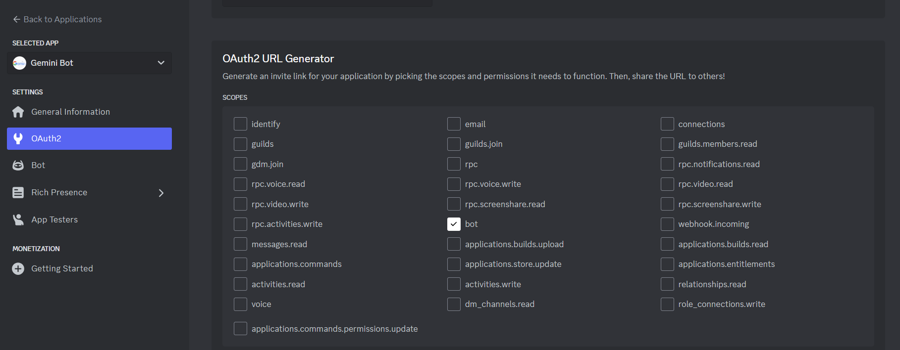
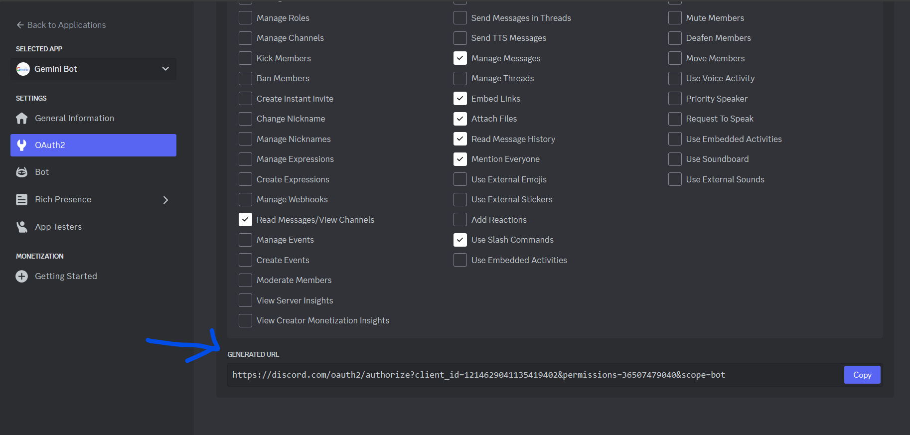

## Step by Step Guide to make your own Gemini API Discord Bot

Try the Gemini Bot by adding to your discord server : [Click here to Add](https://discord.com/oauth2/authorize?client_id=1214629041135419402&permissions=36507479040&scope=bot)

### To Use the Bot
After adding the bot to your discord server then you can simply tag the bot and ask question as below after which you will get your answers shortly 😉


The Bot won't give any response as currently it only works locally. Will host soon at Replit:D

### Setup Initial Coding Workspace
Execute this commands on your IDE on a directory you want to work on
1. ```npm init```
2. ```npm install discord.js```
3. ```npm install @google/generative-ai```

After doing this:

### Making APIs Ready

4. Get Discord API Key via : https://discord.com/developers/applications

After you create a API key then you will get to see a token once so you should copy that and keep it safely somewhere, better to use Google Keep - https://keep.google.com/ for this.

5. Get Gemini API Key via: https://makersuite.google.com/

And to view your already created API key, you can visit: https://aistudio.google.com/app/apikey

And keep both the keys at `.env` file:-
```
DISCORD_API_KEY= # Your Discord API key
GEMINI_API_KEY= # Your Gemini API key 
```
**<u>But make sure to include `.env` file to your `.gitignore` file</u>**

And then enter this code at `index.js` file
```js
require("dotenv").config();
const { Client, GatewayIntentBits } = require("discord.js");
const { GoogleGenerativeAI } = require("@google/generative-ai");

const MODEL_NAME = "gemini-pro";
const client = new Client({
  intents: [
    GatewayIntentBits.Guilds,
    GatewayIntentBits.GuildMessages,
    GatewayIntentBits.MessageContent,
  ],
});

const genAI = new GoogleGenerativeAI(process.env.GEMINI_API_KEY);

client.on("ready", () => {
  console.log("Bot is ready!");
});

client.on("messageCreate", async (message) => {
  if (message.author.bot) return;

  if (message.mentions.has(client.user)) {
    const userMessage = message.content
      .replace(`<@!${client.user.id}>`, "")
      .trim();

    const model = genAI.getGenerativeModel({ model: MODEL_NAME });

    const generationConfig = {
      temperature: 0.9,
      topK: 1,
      topP: 1,
      maxOutputTokens: 2048,
    };

    const parts = [
      {
        text: `input: ${userMessage}`,
      },
    ];

    const result = await model.generateContent({
      contents: [{ role: "user", parts }],
      generationConfig,
    });

    const reply = await result.response.text();
    // due to Discord limitations, we can only send 2000 characters at a time, so we need to split the message
    if (reply.length > 2000) {
      const replyArray = reply.match(/[\s\S]{1,2000}/g);
      replyArray.forEach(async (msg) => {
        await message.reply(msg);
      });
      return;
    }

    message.reply(reply);
  }
});

client.login(process.env.DISCORD_API_KEY);
```

And finally
```js
node index.js
```
You will see this output if everthing is working fine:
```Bot is ready!```

<u>The Bot only works if your process is running which means if you stop the process then the bot won't give you response.</u>

### Making Gemini Bot Ready to Onboard into your Discord Server

Then after setting up OAuth2 from your Discord Developer Dashboard you will be able to invite the bot.

Some guides to follow at Discord Developer Dashboard:-
1. At `OAuth2 URL Generator` choose `bot`

2. Give Necessary Bot Permissions
3. After this you will get a Generated URL for bot invite.

Congrats on making your own Gemini Bot.

Thank you for Reading till the end, I wish to see your own bot live. 

Do let me know if you have any issues at [GDG Kathmandu Discord Server](https://discord.gg/5Q48VRyJ6j)


### Resources I used to make the bot:
- https://razanfawwaz.medium.com/membuat-chatbot-discord-dengan-palm-api-0a041dcd9bc0
- https://github.com/razanfawwaz/gemini-bot?tab=readme-ov-file
- https://ai.google.dev/tutorials/node_quickstart#generate-text-from-text-input
- https://discordjs.guide/preparations/#installing-node-js
- https://ai.google.dev/tutorials/node_quickstart#generate-text-from-text-input